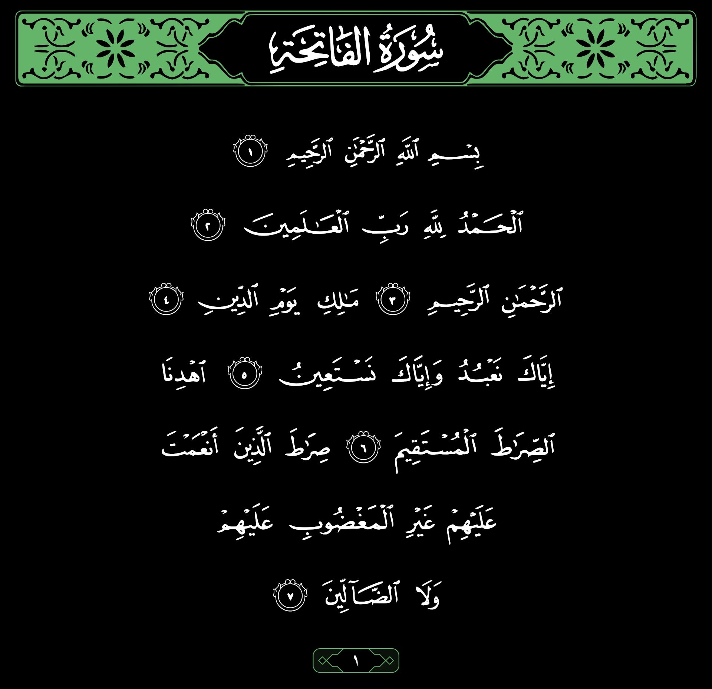
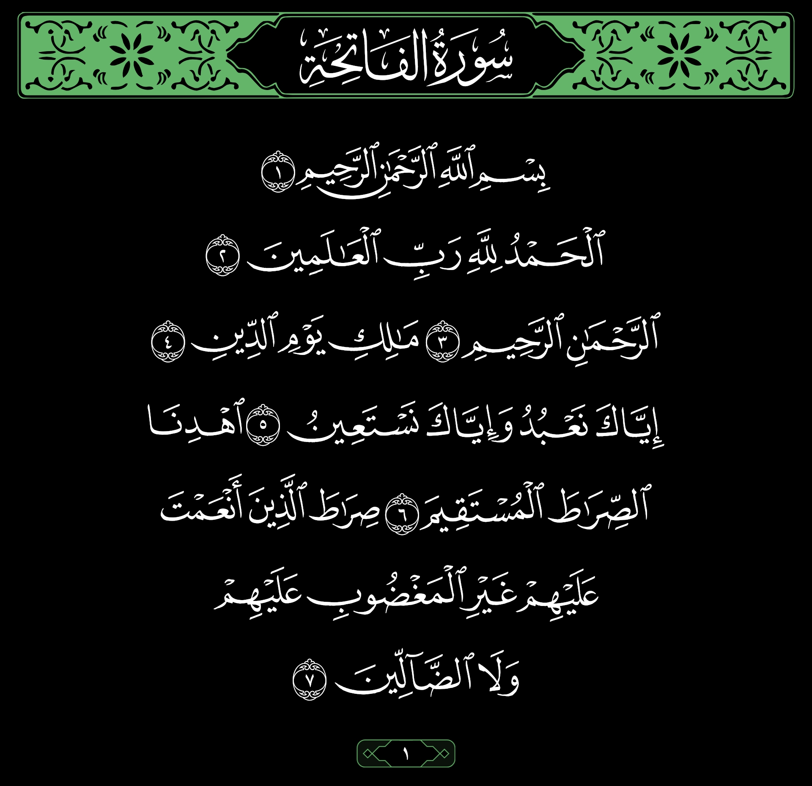
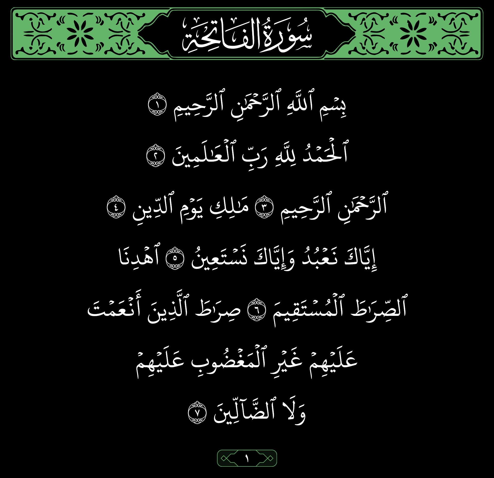
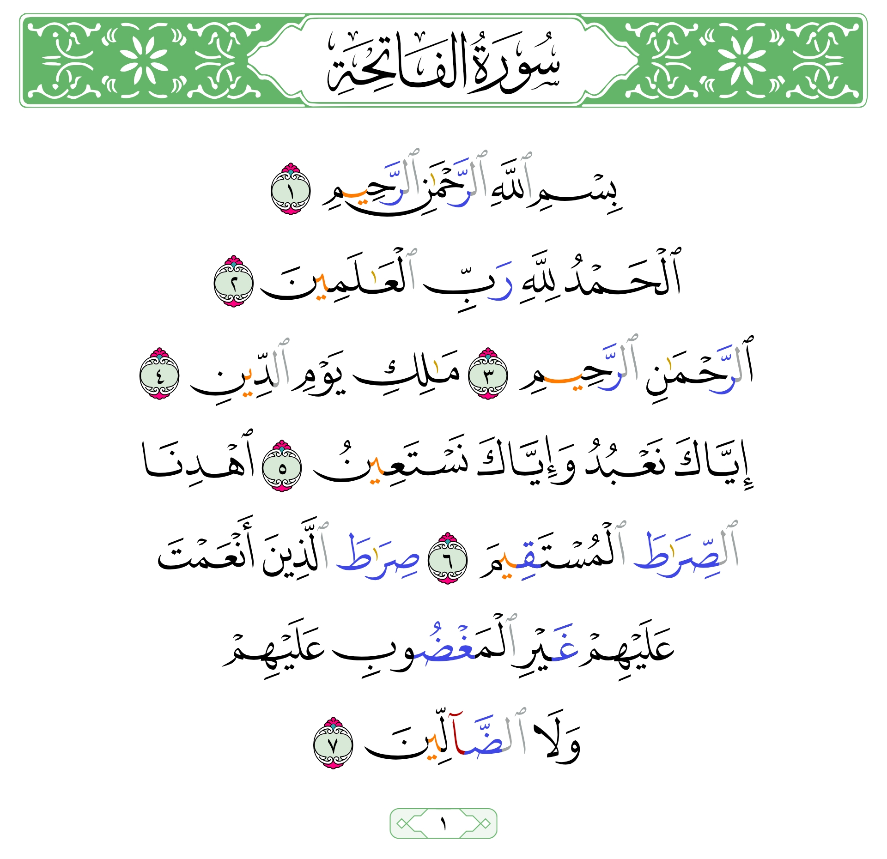
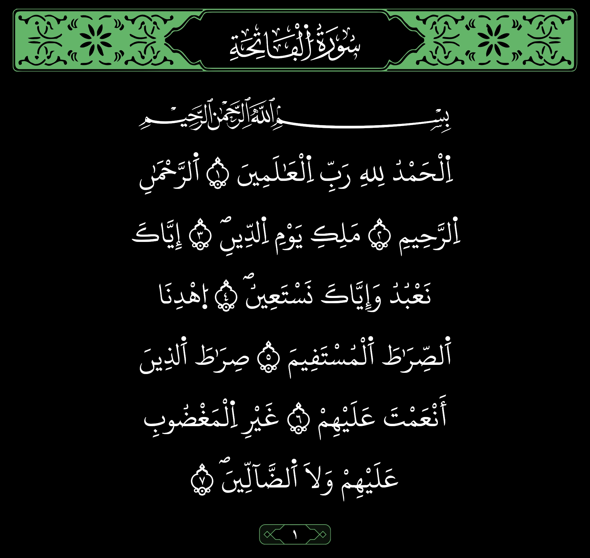
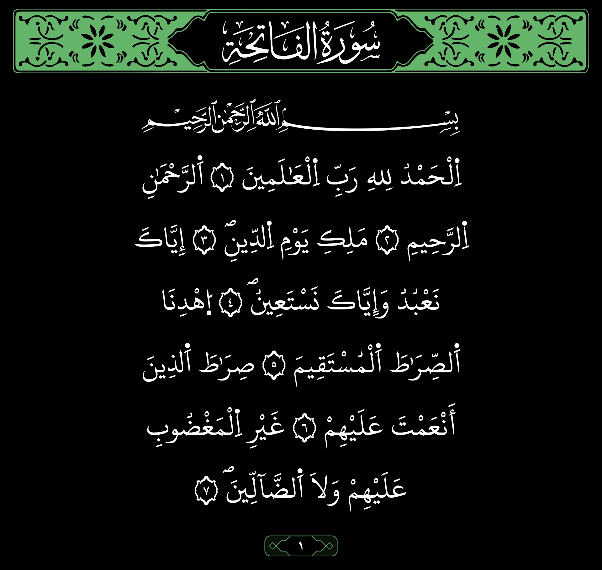
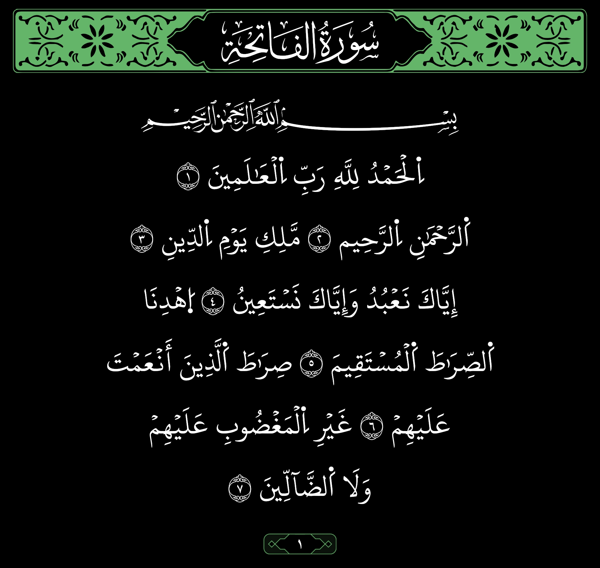
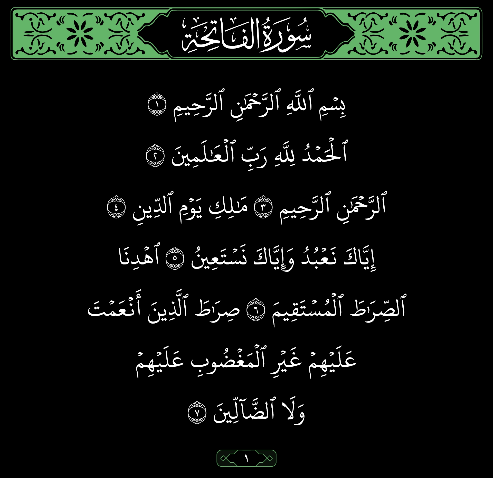

# Quran Image Creator

Generate high-quality images of Quran verses automatically. Supports multiple Madinah Mushaf layouts, recitations, custom themes, page numbers, and exegesis (tafsīr).

## 📸 Samples

These are an examples for the available layouts tested on `Al-Fatihah` Chapter, the code file is under `examples/layouts.js`

|                                                                                                      |                                                                                             |                                                                                             |
| :--------------------------------------------------------------------------------------------------: | :-----------------------------------------------------------------------------------------: | :-----------------------------------------------------------------------------------------: |
|      madinah-1405      |  madinah-1422 |  madinah-1439 |
|  madinah-tajweed |            warsh            |            qalon            |
|                 doori                |              sosi             |           shobah          |

## ✨ Features

- **Multiple Layouts**: Madinah 1405, 1422, 1439, Tajweed, Warsh, Qalon, Sūsi, Dūrī, and Shuʿbah.
- **Page & Section Numbers**: Optional frame-styled page markers at page and section ending
- **Exegesis Support**: Attach tafsīr/translations below verses with custom fonts.
- **Theme Customization**: Light/dark backgrounds, adjustable text & accent colors
- **Zero External APIs**: Works Mostly offline with bundled SQLite databases.

## 📦 Installation

```bash
npm install quran-image-creator
# or
pnpm add quran-image-creator
# or
yarn add quran-image-creator
```

## 🚀 Quick Start

```js
import fs from "node:fs";
import QuranImageCreator from "quran-image-creator";

const image = await QuranImageCreator({
  selection: [{ chapter: 1, from: 1, to: 7 }], // Al-Fatiha
  layout: "madinah-1439",
});

fs.writeFileSync("output.jpeg", image);
```

## 📖 API Reference

### `QuranImageCreator(options) => Promise<Buffer>`

Returns a JPEG image buffer (`image/jpeg`, quality 100).

#### Options

| Option                | Type                   | Default                                 | Description                                                                     |
| --------------------- | ---------------------- | --------------------------------------- | ------------------------------------------------------------------------------- |
| `selection`           | `VerseSelectionType[]` | _required_                              | Array of verse ranges to render                                                 |
| `layout`              | `Layouts`              | `"madinah-1439"`                        | Mushaf layout or recitation variant                                             |
| `height`              | `number`               | _auto_                                  | Fixed canvas height. Omit for auto-sizing                                       |
| `centerVerses`        | `boolean`              | `false`                                 | Center-align verse lines instead of reproducing original page positioning       |
| `ignoreWordsPosition` | `boolean`              | `false`                                 | Reflow words into lines of equal width instead of using original line breaks    |
| `customVerseFrameBox` | `boolean`              | `false`                                 | 🔬 Experimental — renders individual verse-number frames _(may misalign words)_ |
| `theme`               | `Theme`                | _see below_                             | Background & foreground colors                                                  |
| `loadPageNumber`      | `PageNumberOpts`       | `{ pagesEnd: true, sectionsEnd: true }` | When to print page/section frame numbers                                        |
| `exegesisFont`        | `string`               | `"Kitab"`                               | Font name for exegesis text                                                     |
| `loadExegesis`        | `ExegesisLoader`       | _undefined_                             | Async function mapping verse → tafsīr/translation                               |
| `loadVersesFont`      | `FontLoader`           | _undefined_                             | Custom font resolver (buffer per page/layout)                                   |

**Default theme**: `{ foregroundColor: "#64b469", backgroundColor: "#000000" }`

#### Types

```ts
export type VerseSelectionType = {
  chapter: number; // 1–114
  from: number; // starting verse
  to: number; // ending verse (inclusive)
  exegesis?: string; // key used with loadExegesis
};

export type Layouts =
  | "madinah-1405"
  | "madinah-1422"
  | "madinah-1439"
  | "madinah-tajweed"
  | "warsh"
  | "qalon"
  | "sosi"
  | "doori"
  | "shobah";

export type Theme = {
  backgroundColor?: string;
  foregroundColor?: string;
};

export type PageNumberOpts = {
  pagesEnd?: boolean; // print at end of Mushaf page
  sectionsEnd?: boolean; // print at end of the selection
};

export type ExegesisLoader = {
  [key: string]: (data: {
    chapterId: number;
    verseId: number;
  }) => Promise<{ name: string; content: string }>;
};

export type FontLoader = (
  pageId: number,
  layout: Layouts,
) => Promise<Buffer | void>;
```

## 🛠 Usage Examples

### Multiple Selections

```js
QuranImageCreator({
  selection: [
    { chapter: 1, from: 1, to: 7 },
    { chapter: 112, from: 1, to: 4 },
    { chapter: 113, from: 1, to: 5 },
  ],
});
```

Each chapter gets its own header, Basmalah (where applicable), and vertical spacing.

### Dark & Light Themes

```js
// Dark theme with green accent
{ theme: { backgroundColor: "#0d0d0d", foregroundColor: "#64b469" } }

// Light theme with dark text
{ theme: { backgroundColor: "#ffffff", foregroundColor: "#333333" } }
```

> **Note**: `madinah-tajweed` forces a white background; dark mode is not supported for this layout.

### Page & Section Numbers

```js
{
  loadPageNumber: {
    pagesEnd: true,    // show page number at end of each Mushaf page
    sectionsEnd: true,  // show at end of the selection
  }
}
```

Set both to `false` to hide numbers entirely.

### Exegesis / Translation

```js
import { GlobalFonts } from "@napi-rs/canvas";

// if not loaded before.
GlobalFonts.registerFromPath("path/to/Inter.ttf", "Inter");

QuranImageCreator({
  selection: [{ chapter: 1, from: 1, to: 7, exegesis: "en-sahih" }],
  loadExegesis: {
    "en-sahih": async ({ chapterId, verseId }) => {
      const res = await fetch(
        `https://api.alquran.cloud/v1/ayah/${chapterId}:${verseId}/en.sahih`,
      );
      const json = await res.json();
      return {
        name: "Sahih International",
        content: json.data.text,
      };
    },
  },
  exegesisFont: "Inter", // any registered system or loaded font
});
```

Exegesis renders as numbered lines below the verses. The `name` field appears as a heading.

### Custom Font Loading

By default, Madinah 1422 & 1405 fonts are fetched from `quranfonts.com`. Provide your own resolver to use local or CDN-hosted fonts:

```js
import { readFileSync } from "node:fs";

{
  loadVersesFont: (pageId, layout) => {
    const path = `./my-fonts/${layout}/page-${pageId}.woff2`;
    return readFileSync(path);
  };
}
```

If `loadVersesFont` returns `undefined` or `void`, the library falls back to built-in fetching.

### Centered Verses

```js
{
  centerVerses: true;
} // centers all lines after the first
```

Useful for social-media cards where you want symmetrical text blocks.

### Custom Frame Boxes (Experimental)

```js
{
  customVerseFrameBox: false;
}
```

Attempts to wrap each verse number in a decorative frame. Word alignment may be off on certain layouts — use with caution.

> **NOTE: I'd recommend leaving it to its default.**

## ⚠️ Known Limitations

- `madinah-1439-digital` layout is broken, use `madinah-1439` instead.
- `madinah-tajweed` still light mode support only.

If you counter any issue please help me fix it by creating a [new issue](https://github.com/ali-ghamdan/quran-image-creator/issues) in GitHub.

## 📄 License

License Rights for all Muslims.
